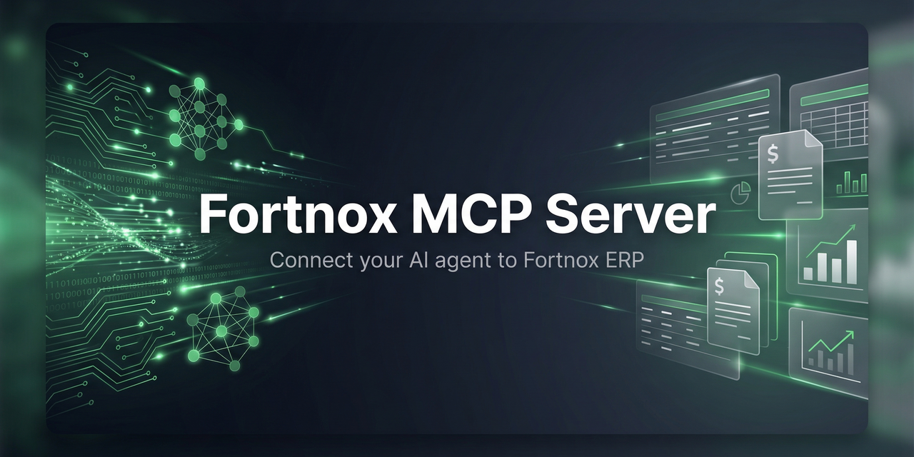
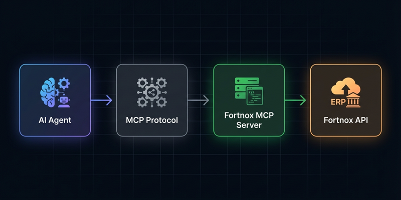

# Fortnox MCP Server

<div align="center">

[](https://modelcontextprotocol.io) [](https://www.typescriptlang.org) [](https://www.fortnox.se/developer) [](LICENSE)

**A read-only MCP server for the [Fortnox](https://www.fortnox.se) ERP API.**

Give your AI agent direct access to supplier invoices, customer invoices, payments, suppliers, customers, articles, and company information — without opening Fortnox.

[Quick Start](#-quick-start) · [Getting Started](#getting-started) · [Tools Reference](#tools-reference) · [API Documentation](#api-documentation) · [Configuration](#configuration)

</div>

---

## Overview

This MCP (Model Context Protocol) server wraps the Fortnox REST API and exposes **14 read-only tools** that any MCP-compatible AI agent can use to query your Fortnox account.

### What can your agent do?

- List and inspect **supplier invoices** — filter by status (unpaid, overdue, pending, etc.)
- List and inspect **customer invoices** — filter by customer, date range, OCR, and more
- View **payments** for both supplier and customer invoices
- Browse **suppliers**, **customers**, and **articles/products**
- Retrieve **company information** and settings

### What it does NOT do

- No create, update, or delete operations
- No access to payroll, offers, orders, or warehouse
- No direct database access — all data comes through the official Fortnox API

---

## Architecture



**Key features:**
- **OAuth2 with auto-refresh** — tokens refresh automatically, no manual intervention
- **Rate limiting** — respects Fortnox's 25 requests / 5 seconds limit
- **Optional Redis cache** — reduces API calls for frequently accessed data
- **Stdio transport** — standard MCP communication protocol

---

## ⚡ Quick Start

For those who want to get up and running fast:

**1. Clone and install**
```bash
git clone https://github.com/rankgnar/fortnox-mcp-server.git
cd fortnox-mcp-server && npm install && npm run build
```

**2. Configure credentials**
```bash
cp .env.example .env
# Edit .env — add your FORTNOX_CLIENT_ID and FORTNOX_CLIENT_SECRET
```

**3. Authorize with Fortnox** *(one-time)*
```bash
npm run auth
# Opens a browser flow — log in and approve. Tokens are saved automatically.
```

**4. Connect to your AI agent**
```json
{
  "mcpServers": {
    "fortnox": {
      "command": "node",
      "args": ["/path/to/fortnox-mcp-server/dist/index.js"]
    }
  }
}
```

> Need more detail? See the full [Getting Started](#getting-started) guide below.

---

## Getting Started

### Prerequisites

- **Node.js** >= 18
- **npm** >= 9
- A **Fortnox account** with API access
- A **Fortnox developer integration** ([create one here](https://apps.fortnox.se))

### 1. Clone and install

```bash
git clone https://github.com/rankgnar/fortnox-mcp-server.git
cd fortnox-mcp-server
npm install
npm run build
```

### 2. Configure credentials

```bash
cp .env.example .env
```

Edit `.env` with your Fortnox integration credentials:

```env
FORTNOX_CLIENT_ID=your_client_id
FORTNOX_CLIENT_SECRET=your_client_secret
```

### 3. Create a Fortnox Integration

1. Go to [apps.fortnox.se](https://apps.fortnox.se) and sign in
2. Create a new integration (Skapa ny Integration)
3. Set the **Redirect URI** to: `http://localhost:9999/callback`
4. Select these **permissions** (Behörigheter):

| Permission (Swedish) | Scope | Description |
|----------------------|-------|-------------|
| Artikel | `article` | Articles / Products |
| Betalningar | `payment` | Payments |
| Faktura | `invoice` | Customer invoices |
| Företagsinformation | `companyinformation` | Company information |
| Kund | `customer` | Customers |
| Leverantör | `supplier` | Suppliers |
| Leverantörsfaktura | `supplierinvoice` | Supplier invoices |

5. Save and copy your **Client-Id** and **Client-Secret**

### 4. Authorize with Fortnox

Run the authorization flow (one-time only):

```bash
npm run auth
```

This will:
1. Print an authorization URL — open it in your browser
2. Log in to Fortnox and authorize the integration
3. Automatically save tokens to `.fortnox-tokens.json`

> **Note:** The access token expires in 1 hour and the refresh token in 45 days. The server refreshes tokens automatically.

### 5. Connect to your AI agent

Add the MCP server to your agent's configuration:

```json
{
  "mcpServers": {
    "fortnox": {
      "command": "node",
      "args": ["/path/to/fortnox-mcp-server/dist/index.js"]
    }
  }
}
```

For development/testing:

```bash
npm run dev
```

---

## Tools Reference

### Supplier Invoices

#### `list_supplier_invoices`

Lists supplier invoices with optional filtering by status.

| Parameter | Type | Required | Description |
|-----------|------|----------|-------------|
| `filter` | string | No | `cancelled` · `fullypaid` · `unpaid` · `unpaidoverdue` · `unbooked` · `pendingpayment` · `authorizepending` |
| `page` | number | No | Page number (default: 1) |
| `limit` | number | No | Results per page (default: 100) |
| `lastmodified` | string | No | Filter from date (YYYY-MM-DD) |

**Example response:**
```json
{
  "MetaInformation": {
    "@CurrentPage": 1,
    "@TotalPages": 3,
    "@TotalResources": 245
  },
  "SupplierInvoices": [
    {
      "GivenNumber": "1",
      "SupplierNumber": "100",
      "SupplierName": "ACME Corp",
      "InvoiceNumber": "F2024-001",
      "InvoiceDate": "2024-01-15",
      "DueDate": "2024-02-15",
      "Total": "15000.00",
      "Balance": "15000.00",
      "Booked": false,
      "Cancel": false,
      "Currency": "SEK"
    }
  ]
}
```

**Response fields:**

| Field | Type | Description |
|-------|------|-------------|
| `GivenNumber` | string | Internal invoice number |
| `SupplierNumber` | string | Supplier identifier |
| `SupplierName` | string | Supplier name |
| `InvoiceNumber` | string | External invoice number |
| `InvoiceDate` | date | Invoice date |
| `DueDate` | date | Payment due date |
| `Total` | string | Total amount |
| `Balance` | string | Remaining balance |
| `Booked` | boolean | Whether the invoice is booked |
| `Cancel` | boolean | Whether the invoice is cancelled |
| `Credit` | boolean | Whether it is a credit invoice |
| `Currency` | string | Currency code (e.g. SEK, EUR) |
| `CurrencyRate` | string | Exchange rate |
| `FinalPayDate` | date | Final payment date |
| `AuthorizerName` | string | Name of authorizer |
| `Project` | string | Project code |
| `CostCenter` | string | Cost center code |

---

#### `get_supplier_invoice`

Retrieves full details of a single supplier invoice including all rows.

| Parameter | Type | Required | Description |
|-----------|------|----------|-------------|
| `number` | string | **Yes** | Supplier invoice number (GivenNumber) |

---

### Supplier Invoice Payments

#### `list_supplier_invoice_payments`

Lists all payments made against supplier invoices.

| Parameter | Type | Required | Description |
|-----------|------|----------|-------------|
| `page` | number | No | Page number |
| `limit` | number | No | Results per page |

**Response fields:**

| Field | Type | Description |
|-------|------|-------------|
| `Number` | integer | Payment number |
| `Amount` | number | Payment amount |
| `Booked` | boolean | Whether the payment is booked |
| `Currency` | string | Currency code |
| `CurrencyRate` | number | Exchange rate |
| `InvoiceNumber` | string | Related invoice number |
| `PaymentDate` | date | Date of payment |
| `Source` | string | `manual` or `direct` |

---

#### `get_supplier_invoice_payment`

Retrieves details of a specific supplier invoice payment.

| Parameter | Type | Required | Description |
|-----------|------|----------|-------------|
| `number` | number | **Yes** | Payment number |

---

### Customer Invoices

#### `list_invoices`

Lists customer invoices with powerful filtering and sorting.

| Parameter | Type | Required | Description |
|-----------|------|----------|-------------|
| `filter` | string | No | `cancelled` · `fullypaid` · `unpaid` · `unpaidoverdue` · `unbooked` |
| `customername` | string | No | Filter by customer name |
| `customernumber` | string | No | Filter by customer number |
| `fromdate` | string | No | From date (YYYY-MM-DD) |
| `todate` | string | No | To date (YYYY-MM-DD) |
| `sortby` | string | No | `customername` · `customernumber` · `documentnumber` · `invoicedate` · `ocr` · `total` |
| `page` | number | No | Page number |
| `limit` | number | No | Results per page |

**Additional Fortnox API filters** (available via direct API):

| Filter | Description |
|--------|-------------|
| `costcenter` | Cost center code |
| `label` | Label |
| `documentnumber` | Document number |
| `fromfinalpaydate` / `tofinalpaydate` | Final payment date range |
| `lastmodified` | Last modified date |
| `ocr` | OCR reference |
| `ourreference` / `yourreference` | Reference fields |
| `project` | Project code |
| `sent` | Whether sent |
| `currency` | Currency code |
| `credit` | Credit invoices |
| `articlenumber` / `articledescription` | Article filters |
| `accountnumberfrom` / `accountnumberto` | Account number range |
| `invoicetype` | `INVOICE` · `AGREEMENTINVOICE` · `INTRESTINVOICE` · `SUMMARYINVOICE` · `CASHINVOICE` |

**Response fields:**

| Field | Type | Description |
|-------|------|-------------|
| `DocumentNumber` | string | Invoice document number |
| `CustomerNumber` | string | Customer identifier |
| `CustomerName` | string | Customer name |
| `InvoiceDate` | date | Invoice date |
| `DueDate` | date | Payment due date |
| `Total` | number | Total amount |
| `Balance` | number | Remaining balance |
| `Currency` | string | Currency code |
| `Booked` | boolean | Booked status |
| `Cancelled` | boolean | Cancelled status |
| `Sent` | boolean | Whether sent to customer |
| `NoxFinans` | boolean | Financed through Fortnox Finans |
| `OCR` | string | OCR reference |
| `InvoiceType` | string | Type of invoice |
| `FinalPayDate` | date | Final payment date |

---

#### `get_invoice`

Retrieves full details of a customer invoice including all rows.

| Parameter | Type | Required | Description |
|-----------|------|----------|-------------|
| `number` | string | **Yes** | Document number |

---

### Invoice Payments

#### `list_invoice_payments`

Lists payments received for customer invoices.

| Parameter | Type | Required | Description |
|-----------|------|----------|-------------|
| `invoicenumber` | string | No | Filter by invoice number |
| `page` | number | No | Page number |
| `limit` | number | No | Results per page |

**Response fields:**

| Field | Type | Description |
|-------|------|-------------|
| `Number` | string | Payment number |
| `Amount` | number | Payment amount |
| `Booked` | boolean | Booked status |
| `Currency` | string | Currency code (3 chars) |
| `CurrencyRate` | number | Exchange rate |
| `InvoiceNumber` | integer | Related invoice number |
| `PaymentDate` | date | Date of payment |
| `Source` | string | Payment source |

---

#### `get_invoice_payment`

Retrieves details of a specific customer invoice payment.

| Parameter | Type | Required | Description |
|-----------|------|----------|-------------|
| `number` | number | **Yes** | Payment number |

---

### Suppliers

#### `list_suppliers`

Lists all suppliers. Filter by name.

| Parameter | Type | Required | Description |
|-----------|------|----------|-------------|
| `name` | string | No | Filter by supplier name |
| `page` | number | No | Page number |
| `limit` | number | No | Results per page |

**Response fields:**

| Field | Type | Description |
|-------|------|-------------|
| `SupplierNumber` | string | Supplier identifier |
| `Name` | string | Supplier name |
| `Address1` / `Address2` | string | Address lines |
| `City` | string | City |
| `ZipCode` | string | Postal code |
| `CountryCode` | string | ISO country code (2 chars) |
| `Email` | string | Email address |
| `Phone` | string | Phone number |
| `OrganisationNumber` | string | Organization number |
| `BankAccountNumber` | string | Bank account |
| `BG` | string | Bankgiro |
| `PG` | string | Plusgiro |
| `BIC` | string | BIC/SWIFT code |
| `IBAN` | string | IBAN |
| `Currency` | string | Default currency |
| `Active` | boolean | Active status |

---

#### `get_supplier`

Retrieves full details of a single supplier.

| Parameter | Type | Required | Description |
|-----------|------|----------|-------------|
| `number` | string | **Yes** | Supplier number |

---

### Customers

#### `list_customers`

Lists all customers with filtering options.

| Parameter | Type | Required | Description |
|-----------|------|----------|-------------|
| `name` | string | No | Filter by name |
| `city` | string | No | Filter by city |
| `email` | string | No | Filter by email |
| `page` | number | No | Page number |
| `limit` | number | No | Results per page |

**Additional Fortnox API filters:**

| Filter | Description |
|--------|-------------|
| `filter` | `active` or `inactive` |
| `customernumber` | Customer number |
| `zipcode` | Postal code |
| `phone` | Phone number |
| `organisationnumber` | Organization number |
| `gln` / `glndelivery` | GLN codes |
| `sortby` | `customernumber` or `name` |

**Response fields:**

| Field | Type | Description |
|-------|------|-------------|
| `CustomerNumber` | string | Customer identifier |
| `Name` | string | Customer name |
| `Address1` / `Address2` | string | Address lines |
| `City` | string | City |
| `ZipCode` | string | Postal code (max 10 chars) |
| `Email` | string | Email address |
| `Phone` | string | Phone number |
| `OrganisationNumber` | string | Organization number (max 30 chars) |

---

#### `get_customer`

Retrieves full details of a single customer.

| Parameter | Type | Required | Description |
|-----------|------|----------|-------------|
| `number` | string | **Yes** | Customer number |

---

### Articles

#### `list_articles`

Lists articles/products with filtering and sorting.

| Parameter | Type | Required | Description |
|-----------|------|----------|-------------|
| `description` | string | No | Filter by description |
| `articlenumber` | string | No | Filter by article number |
| `ean` | string | No | Filter by EAN code |
| `suppliernumber` | string | No | Filter by supplier |
| `manufacturer` | string | No | Filter by manufacturer |
| `page` | number | No | Page number |
| `limit` | number | No | Results per page |

**Additional Fortnox API options:**

| Option | Description |
|--------|-------------|
| `filter` | `active` or `inactive` |
| `manufacturerarticlenumber` | Manufacturer article number |
| `webshop` | Webshop articles |
| `sortby` | `articlenumber` · `quantityinstock` · `reservedquantity` · `stockvalue` |

**Response fields:**

| Field | Type | Description |
|-------|------|-------------|
| `ArticleNumber` | string | Article identifier (max 50 chars) |
| `Description` | string | Article description (max 200 chars) |
| `EAN` | string | EAN barcode (max 30 chars) |
| `PurchasePrice` | string | Purchase price |
| `SalesPrice` | string | Sales price |
| `QuantityInStock` | number | Current stock quantity |
| `ReservedQuantity` | string | Reserved quantity |
| `StockValue` | string | Total stock value |
| `StockPlace` | string | Stock location |
| `Unit` | string | Unit of measure |
| `VAT` | string | VAT percentage |
| `Housework` | boolean | Housework (ROT/RUT) article |
| `WebshopArticle` | boolean | Published to webshop |

---

#### `get_article`

Retrieves full details of a single article.

| Parameter | Type | Required | Description |
|-----------|------|----------|-------------|
| `number` | string | **Yes** | Article number |

---

### Company

#### `get_company_info`

Retrieves company information. No parameters required.

**Response fields:**

| Field | Type | Description |
|-------|------|-------------|
| `CompanyName` | string | Legal company name |
| `OrganizationNumber` | string | Swedish organization number |
| `Address` | string | Street address |
| `City` | string | City |
| `ZipCode` | string | Postal code |
| `CountryCode` | string | ISO country code |
| `DatabaseNumber` | integer | Fortnox database number |
| `VisitAddress` | string | Visiting address |
| `VisitCity` | string | Visiting city |
| `VisitZipCode` | string | Visiting postal code |

---

#### `get_company_settings`

Retrieves company settings. No parameters required.

**Response fields:**

| Field | Type | Description |
|-------|------|-------------|
| `Name` | string | Company name |
| `OrganizationNumber` | string | Organization number |
| `Address` | string | Address |
| `City` | string | City |
| `ZipCode` | string | Postal code |
| `Country` / `CountryCode` | string | Country |
| `Email` | string | Company email |
| `Phone1` / `Phone2` | string | Phone numbers |
| `BG` | string | Bankgiro |
| `PG` | string | Plusgiro |
| `BIC` | string | BIC/SWIFT |
| `IBAN` | string | IBAN |
| `VATNumber` | string | VAT number |
| `TaxEnabled` | boolean | Tax enabled |
| `WWW` | string | Website |

---

## API Documentation

### Authentication

This server uses **OAuth2 Authorization Code Flow** with automatic token refresh.

| Token | Lifetime | Auto-refresh |
|-------|----------|-------------|
| Access Token | 1 hour | Yes |
| Refresh Token | 45 days | Yes (on use) |

**Flow:**
1. `npm run auth` starts a local server on port 9999
2. User opens the authorization URL in a browser
3. User logs in to Fortnox and approves the integration
4. Fortnox redirects to `http://localhost:9999/callback` with an authorization code
5. The server exchanges the code for access + refresh tokens
6. Tokens are saved to `.fortnox-tokens.json`

On subsequent requests, the server automatically refreshes expired tokens.

### Rate Limiting

Fortnox enforces **25 requests per 5-second window** (300 requests/minute).

This server implements a sliding-window rate limiter that:
- Tracks request timestamps in memory
- Delays requests when approaching the limit
- Handles `429 Too Many Requests` with automatic retry
- Is configurable via environment variables

### Caching (Optional)

When Redis is configured, responses are cached to reduce API calls:

| Resource | TTL | Rationale |
|----------|-----|-----------|
| Company info / settings | 1 hour | Rarely changes |
| Suppliers / Customers | 5 minutes | Changes infrequently |
| Articles | 10 minutes | Moderate change rate |
| Invoices / Payments | 2 minutes | More dynamic |

### Error Handling

Fortnox API errors are returned in a structured format:

```json
{
  "ErrorInformation": {
    "Error": 1,
    "Message": "Supplier invoice not found",
    "Code": 2000404
  }
}
```

The MCP server catches these and returns human-readable error messages to the agent.

### Pagination

List endpoints support pagination through the Fortnox API:

```json
{
  "MetaInformation": {
    "@CurrentPage": 1,
    "@TotalPages": 5,
    "@TotalResources": 487
  }
}
```

Use the `page` parameter to navigate through results.

---

## Configuration

### Environment Variables

| Variable | Required | Default | Description |
|----------|----------|---------|-------------|
| `FORTNOX_CLIENT_ID` | Yes | — | Integration Client-Id |
| `FORTNOX_CLIENT_SECRET` | Yes | — | Integration Client-Secret |
| `FORTNOX_ACCESS_TOKEN` | No | — | Override access token |
| `FORTNOX_REFRESH_TOKEN` | No | — | Override refresh token |
| `REDIS_URL` | No | — | Redis connection URL (e.g. `redis://localhost:6379`) |
| `FORTNOX_RATE_LIMIT` | No | `25` | Max requests per window |
| `FORTNOX_RATE_WINDOW_MS` | No | `5000` | Rate limit window in ms |

### Project Structure

```
fortnox-mcp-server/
├── src/
│   ├── index.ts                 # Entry point (stdio transport)
│   ├── server.ts                # MCP server setup & tool registration
│   ├── auth/
│   │   ├── oauth2.ts            # Token management & auto-refresh
│   │   └── setup.ts             # One-time OAuth2 authorization flow
│   ├── client/
│   │   └── fortnox.ts           # HTTP client with rate limiting
│   ├── cache/
│   │   └── redis.ts             # Optional Redis cache
│   ├── tools/
│   │   ├── supplier-invoices.ts # Supplier invoice tools
│   │   ├── supplier-invoice-payments.ts
│   │   ├── suppliers.ts         # Supplier tools
│   │   ├── invoices.ts          # Customer invoice tools
│   │   ├── invoice-payments.ts
│   │   ├── customers.ts         # Customer tools
│   │   ├── articles.ts          # Article tools
│   │   └── company.ts           # Company info tools
│   └── types/
│       └── fortnox.ts           # TypeScript interfaces
├── .env.example                 # Environment template
├── package.json
└── tsconfig.json
```

---

## Scripts

| Command | Description |
|---------|-------------|
| `npm run build` | Compile TypeScript to `dist/` |
| `npm run dev` | Run in development mode (tsx) |
| `npm start` | Run compiled server |
| `npm run auth` | OAuth2 authorization setup |

---

## Fortnox API Reference

- [Fortnox Developer Portal](https://www.fortnox.se/developer)
- [API Documentation](https://apps.fortnox.se/apidocs)
- [Authorization Guide](https://www.fortnox.se/developer/authorization)
- [Scopes Reference](https://www.fortnox.se/developer/guides-and-good-to-know/scopes)
- [Rate Limits](https://www.fortnox.se/developer/guides-and-good-to-know/rate-limits-for-fortnox-api)

---

## License

MIT
